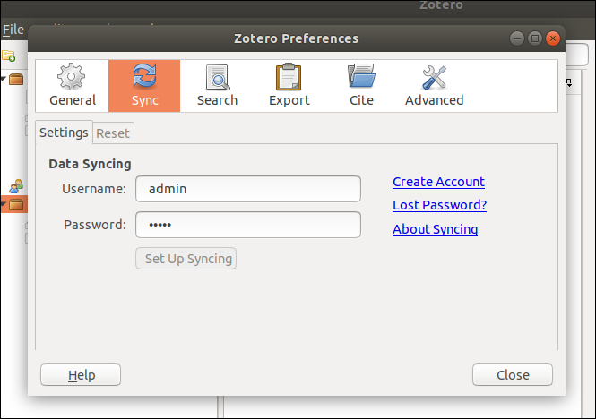

# ZotPrime - On-premise Zotero platform

ZotPrime is a full packaged repository aimed to make on-premise [Zotero](https://www.zotero.org) deployment easier with the last versions of both Zotero client and server. This is the result of sleepness nights spent to deploy Zotero within my organization on a disconnected network. Feel free to open issues or pull requests if you did not manage to use it.

## Server installation

### Dependencies and source code

*Install dependencies for client build*:
```bash
$ sudo apt install npm
```

*Clone the repository (with **--recursive**)*:
```bash
$ mkdir /path/to/your/app && cd /path/to/your/app
$ git clone --recursive https://github.com/SamuelHassine/zotero-prime.git
$ cd zotero-prime
```

*Configure and run*:
```bash
$ cd docker
$ sudo docker-compose up -d
```

### Initialize databases

*Initialize databases*:
```bash
$ ./bin/init.sh
$ cd ..
```

*Available endpoints*:

| Name          | URL                                           |
| ------------- | --------------------------------------------- |
| Zotero API    | http://localhost:8080                         |
| S3 Web UI     | http://localhost:8082                         |
| PHPMyAdmin    | http://localhost:8083                         |

*Default login/password*:

| Name          | Login                    | Password           |
| ------------- | ------------------------ | ------------------ |
| Zotero API    | admin                    | admin              |
| S3 Web UI     | zotero                   | zoterodocker       |
| PHPMyAdmin    | root                     | zotero             |

## Client installation

### Dependencies and source code

For [m|l|w]: m=Mac, w=Windows, l=Linux

*Run*:
```bash
$ cd client
$ ./config.sh
$ cd zotero-client
$ npm install
$ npm run build
$ cd ../zotero-standalone-build
$ ./fetch_xulrunner.sh -p [m|l|w]
$ ./fetch_pdftools
$ ./scripts/dir_build -p [m|l|w]
```

### First usage

*Run*:
```bash
$ ./staging/Zotero_VERSION/zotero(.exe)
```

*Connect with the default user and password*:

| Name          | Login                    | Password           |
| ------------- | ------------------------ | ------------------ |
| Zotero        | admin                    | admin              |


